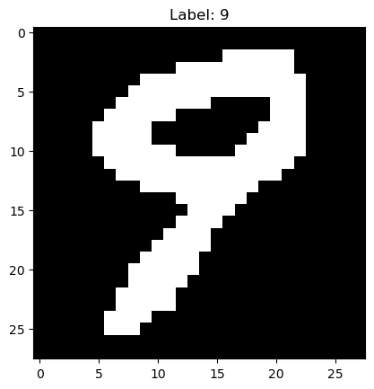

# I TRAINED A MODEL USING ONLY NUMPY AND PANDAS AND THEN DEPLOYED IT ON A 10 YEARS OLD ANDROID PHONE

### The Story
- A fun project that I made in 2020 then refactored recently.
- I built this machine learning model (multi-class logistic regression) from scratch, using EMNIST dataset to recognize hand-written numbers.
- It was just a simple model, but helped me understand a lot when started learning ML.

### Goal 
To share with friends, since it cool 
### Solution 
Need to host somewhere -> I have an old phone and an old router -> Deploy on the phone -> must make the model lightweight
### Process
- Use EMNIST dataset (previously used MNIST).
- Process the data (rotate, flip).
- Convert to non transparent data for digital input  
Before:  
  
After:  

- Flatten the data to 28x28 1D array, which looks like this:
```
0,0.0,0.0,0.0,0.0,0.0,0.0,0.0,0.0,0.0,0.0,0.0,0.0,0.0,0.0,0.0,0.0,0.0,0.0,0.0,0.0,0.0,0.0,0.0,0.0,0.0,0.0,0.0,0.0,0.0,0.0,0.0,0.0,0.0,0.0,0.0,0.0,0.0,0.0,0.0,0.0,0.0,0.0,0.0,0.007843137718737125,0.01568627543747425,0.01568627543747425,0.007843137718737125,0.0,0.0,0.0,0.0,0.0,0.0,0.0,0.0,0.0,0.0,0.0,0.0,0.0,0.0,0.0,0.0,0.0,0.0,0.0,0.0,0.0,0.0117647061124444,0.125490203499794,0.20000000298023224,0.6666666865348816,0.843137264251709,0.8509804010391235,0.6745098233222961,0.45098039507865906,0.13333334028720856,0.027450980618596077,0.0,0.0,0.0,0.0,0.0,0.0,0.0,0.0,0.0,0.0,0.0,0.0,0.0,0.0,0.0,0.0,0.0,0.03921568766236305,0.30980393290519714,0.800000011920929,0.8705882430076599,0.9843137264251709,0.9960784316062927,0.9960784316062927,0.9882352948188782,0.9607843160629272,0.7960784435272217,0.3529411852359772,0.03529411926865578,0.0,0.0,0.0,0.0,0.0,0.0,0.0,0.0,0.0,0.0,0.0,0.0,0.0,0.0,0.0,0.07450980693101883,0.47843137383461,0.8627451062202454,0.9686274528503418,0.8705882430076599,0.8509804010391235,0.8549019694328308,0.9137254953384399,0.9176470637321472,0.9215686321258545,0.9921568632125854,0.8588235378265381,0.35686275362968445,0.003921568859368563,0.0,0.0,0.0,0.0,0.0,0.0,0.0,0.0,0.0,0.0,0.0,0.0,0.0,0.0,0.3294117748737335,0.9137254953384399,0.9843137264251709,0.49803921580314636,0.0470588244497776,0.01568627543747425,0.019607843831181526,0.08235294371843338,0.08235294371843338,0.1921568661928177,0.95686274766922,0.9960784316062927,0.95686274766922,0.18039216101169586,0.0,0.0,0.0,0.0,0.0,0.0,0.0,0.0,0.0,0.0,0.0,0.0,0.0,0.007843137718737125,0.6666666865348816,0.9764705896377563,0.7411764860153198,0.125490203499794,0.0,0.0,0.0,0.0,0.0,0.027450980618596077,0.6431372761726379,0.9686274528503418,0.9960784316062927,0.4470588266849518,0.01568627543747425,0.0,0.0,0.0,0.0,0.0,0.0,0.0,0.0,0.0,0.0,0.0,0.0,0.08235294371843338,0.9137254953384399,0.9176470637321472,0.33725491166114807,0.0117647061124444,0.01568627543747425,0.007843137718737125,0.0,0.0,0.0,0.0,0.15294118225574493,0.8549019694328308,0.9960784316062927,0.49803921580314636,0.01568627543747425,0.0,0.0,0.0,0.0,0.0,0.0,0.0,0.0,0.0,0.0,0.0,0.0,0.14901961386203766,0.9764705896377563,0.9254902005195618,0.5764706134796143,0.37254902720451355,0.45098039507865906,0.3019607961177826,0.0313725508749485,0.0,0.0,0.0,0.14509804546833038,0.8509804010391235,0.9960784316062927,0.49803921580314636,0.01568627543747425,0.0,0.0,0.0,0.0,0.0,0.0,0.0,0.0,0.0,0.0,0.003921568859368563,0.30980393290519714,0.6901960968971252,0.9960784316062927,0.9450980424880981,0.6235294342041016,0.7411764860153198,0.9843137264251709,0.9529411792755127,0.4431372582912445,0.01568627543747425,0.0,0.0,0.14509804546833038,0.8509804010391235,0.9960784316062927,0.49803921580314636,0.01568627543747425,0.0,0.0,0.0,0.0,0.0,0.0,0.0,0.0,0.0,0.003921568859368563,0.13725490868091583,0.8588235378265381,0.9882352948188782,0.9450980424880981,0.9137254953384399,0.40784314274787903,0.43921568989753723,0.9176470637321472,0.9764705896377563,0.4901960790157318,0.01568627543747425,0.0,0.0,0.14509804546833038,0.8509804010391235,0.9960784316062927,0.49803921580314636,0.01568627543747425,0.0,0.0,0.0,0.0,0.0,0.0,0.0,0.0,0.003921568859368563,0.13725490868091583,0.6392157077789307,0.9921568632125854,0.9921568632125854,0.5686274766921997,0.40392157435417175,0.125490203499794,0.14901961386203766,0.7372549176216125,0.9019607901573181,0.3176470696926117,0.007843137718737125,0.0,0.0,0.14509804546833038,0.8509804010391235,0.9960784316062927,0.49803921580314636,0.01568627543747425,0.0,0.0,0.0,0.0,0.0,0.0,0.0,0.0,0.13333334028720856,0.7960784435272217,0.9921568632125854,0.9921568632125854,0.8117647171020508,0.03921568766236305,0.0,0.0,0.027450980618596077,0.33725491166114807,0.2235294133424759,0.019607843831181526,0.0,0.0,0.0,0.37254902720451355,0.9176470637321472,0.9843137264251709,0.32156863808631897,0.007843137718737125,0.0,0.0,0.0,0.0,0.0,0.0,0.0,0.0,0.3294117748737335,0.9137254953384399,1.0,0.8666666746139526,0.35686275362968445,0.0,0.0,0.0,0.0,0.0235294122248888,0.019607843831181526,0.0,0.0,0.0,0.0313725508749485,0.8117647171020508,0.9921568632125854,0.9098039269447327,0.08627451211214066,0.0,0.0,0.0,0.0,0.0,0.0,0.0,0.0,0.0784313753247261,0.8627451062202454,0.9960784316062927,0.9686274528503418,0.30980393290519714,0.0117647061124444,0.0,0.0,0.0,0.0,0.0,0.0,0.0,0.0,0.003921568859368563,0.20392157137393951,0.9803921580314636,0.9647058844566345,0.49803921580314636,0.0,0.0,0.0,0.0,0.0,0.0,0.0,0.0,0.0,0.14509804546833038,0.9764705896377563,0.9960784316062927,0.8196078538894653,0.03921568766236305,0.0,0.0,0.0,0.0,0.0,0.0,0.0,0.0,0.0,0.12941177189350128,0.6431372761726379,0.9882352948188782,0.8117647171020508,0.18039216101169586,0.0,0.0,0.0,0.0,0.0,0.0,0.0,0.0,0.0,0.14509804546833038,0.9803921580314636,0.9803921580314636,0.5058823823928833,0.0,0.0,0.0,0.0,0.0,0.0,0.0,0.0,0.0,0.0313725508749485,0.686274528503418,0.9882352948188782,0.8627451062202454,0.20392157137393951,0.003921568859368563,0.0,0.0,0.0,0.0,0.0,0.0,0.0,0.0,0.0,0.20000000298023224,0.9843137264251709,0.9764705896377563,0.4901960790157318,0.0,0.0,0.0,0.0,0.0,0.0,0.0,0.0,0.0117647061124444,0.30980393290519714,0.9647058844566345,0.9921568632125854,0.6196078658103943,0.0784313753247261,0.0,0.0,0.0,0.0,0.0,0.0,0.0,0.0,0.0,0.01568627543747425,0.4470588266849518,0.9960784316062927,0.9137254953384399,0.32156863808631897,0.0,0.0,0.0,0.0,0.0,0.0,0.0,0.0,0.0941176488995552,0.6705882549285889,0.9921568632125854,0.8588235378265381,0.13725490868091583,0.003921568859368563,0.0,0.0,0.0,0.0,0.0,0.0,0.0,0.0,0.0,0.01568627543747425,0.49803921580314636,0.9960784316062927,0.9137254953384399,0.32156863808631897,0.0,0.0,0.0,0.0,0.0,0.0,0.0,0.12941177189350128,0.7490196228027344,0.9725490212440491,0.686274528503418,0.1411764770746231,0.0,0.0,0.0,0.0,0.0,0.0,0.0,0.0,0.0,0.0,0.0,0.01568627543747425,0.4901960790157318,0.9960784316062927,0.9764705896377563,0.4941176474094391,0.0,0.0,0.0,0.0,0.0,0.0,0.003921568859368563,0.3764705955982208,0.9137254953384399,0.8705882430076599,0.26274511218070984,0.0117647061124444,0.0,0.0,0.0,0.0,0.0,0.0,0.0,0.0,0.0,0.0,0.0,0.0,0.20000000298023224,0.9843137264251709,0.9882352948188782,0.6941176652908325,0.03529411926865578,0.0,0.0,0.0,0.0117647061124444,0.13333334028720856,0.3764705955982208,0.9607843160629272,0.9019607901573181,0.32549020648002625,0.0,0.0,0.0,0.0,0.0,0.0,0.0,0.0,0.0,0.0,0.0,0.0,0.0,0.0,0.125490203499794,0.9529411792755127,0.9960784316062927,0.9647058844566345,0.3764705955982208,0.15294118225574493,0.14509804546833038,0.15294118225574493,0.3294117748737335,0.800000011920929,0.9176470637321472,0.9098039269447327,0.49803921580314636,0.0784313753247261,0.0,0.0,0.0,0.0,0.0,0.0,0.0,0.0,0.0,0.0,0.0,0.0,0.0,0.0,0.003921568859368563,0.37254902720451355,0.9058823585510254,0.9960784316062927,0.9882352948188782,0.9803921580314636,0.9803921580314636,0.9803921580314636,0.9882352948188782,0.9843137264251709,0.8588235378265381,0.18431372940540314,0.019607843831181526,0.0,0.0,0.0,0.0,0.0,0.0,0.0,0.0,0.0,0.0,0.0,0.0,0.0,0.0,0.0,0.0,0.0784313753247261,0.48235294222831726,0.8627451062202454,0.9882352948188782,0.9960784316062927,0.9960784316062927,0.9960784316062927,0.9647058844566345,0.6705882549285889,0.30980393290519714,0.003921568859368563,0.0,0.0,0.0,0.0,0.0,0.0,0.0,0.0,0.0,0.0,0.0,0.0,0.0,0.0,0.0,0.0,0.0,0.0,0.03921568766236305,0.3019607961177826,0.6745098233222961,0.843137264251709,0.8509804010391235,0.800000011920929,0.49803921580314636,0.08627451211214066,0.0117647061124444,0.0,0.0,0.0,0.0,0.0,0.0,0.0,0.0,0.0,0.0,0.0,0.0,0.0,0.0,0.0,0.0,0.0,0.0,0.0,0.0,0.0,0.007843137718737125,0.01568627543747425,0.01568627543747425,0.01568627543747425,0.0,0.0,0.0,0.0,0.0,0.0,0.0,0.0,0.0,0.0,0.0,0.0,0.0,0.0,0.0,0.0,0.0,0.0,0.0,0.0,0.0,0.0,0.0,0.0,0.0,0.0,0.0,0.0,0.0,0.0,0.0,0.0,0.0,0.0,0.0,0.0,0.0,0.0,0.0,0.0,0.0,0.0,0.0,0.0
```
- y as the label, X is the flattened pixels.
- Build the model with random initial weights and biases.
- Train the model and export weights and biases to csv.
- Deploy the model and simple interface on the phone.
### [Test It Here](http://5.150.216.178:8000/)